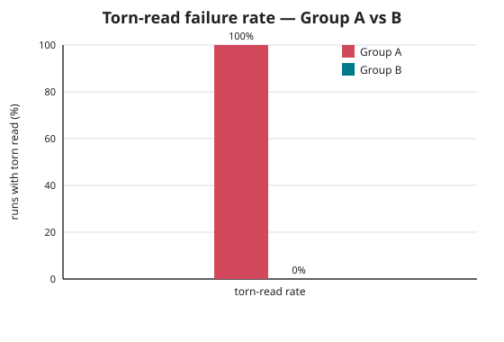
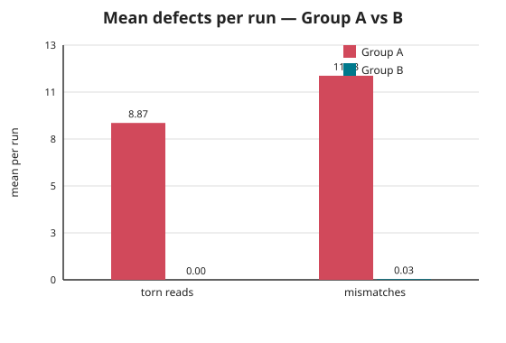
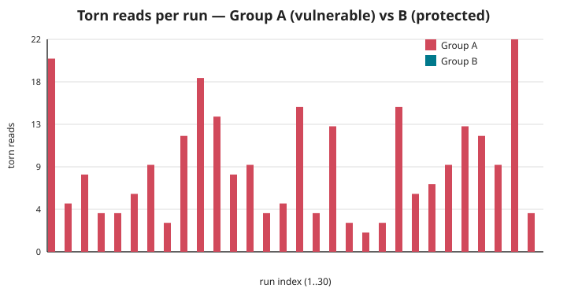

# Final Report — Concurrency Verification of FreeRTOS Firmware with UVM-SystemC

**SoC Specialization — University of València (UV)**
Coverage-driven verification of concurrency hazards (race conditions, false
sharing, deadlock, priority inversion) in a FreeRTOS-style environmental
controller, run on a simulated HAL under a UVM-SystemC testbench.

---

## Abstract

The same firmware, in a vulnerable (Group A) and a mutex-protected (Group B)
build, is exercised by one UVM-SystemC testbench over a simulated HAL. Across a
30-run statistical campaign, Group A exhibits torn reads of shared sensor data in
**100% of runs**, while Group B exhibits **none** — the mutex removes the race
outright. Two hazards not measurable inside the full run (false sharing, mutex
overhead) are quantified with isolated microbenchmarks: false sharing costs
**7.2×**, and an unprotected shared counter runs 23× faster only by **losing ~69%
of its updates**. Liveness is confirmed: neither group deadlocks, and the
watchdog covers all five tasks while distinguishing completion from a stall.

## 1. Motivation and approach

Hardware being unavailable, the real firmware runs on a simulated HAL inside a
SystemC virtual platform; a UVM-SystemC testbench applies coverage-driven
verification. The design is deliberately comparative — Group A and Group B differ
only in synchronization — so any difference the testbench reports is attributable
to concurrency protection alone. Full architecture, HAL bridge, and checker design
are in [methodology.md](../methodology.md); scope and success criteria in
[verification_plan.md](../verification_plan.md).

## 2. Functional correctness (statistical stress, N = 30)

Because the DUT tasks are real pthreads, each run is an independent sample of the
scheduler's interleaving. The authoritative signal is the **direct torn-read
coherence check** (did `control_task` consume a temperature/humidity pair that
never co-occurred in one real sensor reading?).

| Metric | Group A (vulnerable) | Group B (protected) |
|---|---|---|
| **Torn-read failure rate** (authoritative) | **100.0%** (30/30) | **0.0%** (0/30) |
| Torn reads — mean / max | 8.87 / 22 | 0.00 / 0 |
| Mismatch rate (weak reconstruction check) | 100.0% | 3.3% (1/30) |
| Mismatches — mean / max | 11.53 / 34 | 0.03 / 1 |
| Deadlocks flagged | 0 | 0 |





**Reading Group B honestly.** Group B has zero torn reads — the race is gone. Its
1/30 "mismatch" comes from the *weak* output-reconstruction checker (the
reference model's finite 5-sample window occasionally cannot re-derive a correct
actuator output), not from real concurrency defects: the same runs report zero
torn reads. This is why the torn-read rate, not the mismatch rate, is the headline
metric.

**Root cause (Group A).** `sensor_task` writes temperature then humidity as two
stores; `control_task` reads both without a lock, so it can mix fields from two
readings. Group B wraps the accesses in a mutex, restoring atomicity and
visibility. See [defect_log.md](../defect_log.md) D1.

## 3. Isolated performance analysis

The full firmware runs in ≈10.2 s (A) vs ≈10.25 s (B) — indistinguishable —
because wall time is dominated by the tasks' random `hal_delay_ms` sleeps. False
sharing and mutex cost are therefore measured in isolation, each varying exactly
one factor (wall-clock timing, threads pinned to distinct cores, no profiler).

### 3.1 False sharing

Four threads each increment **only their own** counter — no logical sharing. The
sole variable is memory layout:

| Layout | Time (best of 3) | |
|---|---|---|
| Packed (shared 64 B cache line) | 0.536 s | **7.2× slower** |
| Padded (own cache line) | 0.075 s | baseline |

The 7.2× penalty is pure cache-coherence traffic. In the DUT, Group A's ~19 B of
hot globals share one cache line across four writer tasks; Group B aligns the
hottest struct (`sensor_data`) to its own line. See [defect_log.md](../defect_log.md)
D2.

### 3.2 Mutex overhead

| Measurement | Result |
|---|---|
| Uncontended lock + op + unlock | **7.0 ns** per critical section |
| Contended (4 threads, one counter): time cost | **23×** vs unprotected |
| Contended: correctness of the unprotected path | **loses 27.5M / 40M updates (68.8%)** |

The unprotected path is fast and wrong — it drops ~69% of its increments. That loss
*is* the Group A race, quantified: the mutex's cost buys correctness. See
[defect_log.md](../defect_log.md) D3.

## 4. Liveness: deadlock and priority inversion

Neither group reports a deadlock. The watchdog keys on simulated time, tracks all
five tasks, and distinguishes normal completion from a genuine stall — a finished
task is excluded so its trailing silence is not mistaken for a hang; sparse
producers (comm) are kept visibly alive with a throttled liveness heartbeat; and a
periodic silence-probe tick catches total silence even with no events flowing. A
hang proxy confirms a real mid-run stall is flagged with no false positives on
completion. Priority inversion is instrumented from mutex-wait times and exercised
by `priority_inversion_test` (tasks pinned to one core).

## 5. Coverage and reproducibility

Functional coverage bins record temperature range × priority × task, plus
critical-corner hits. Every result in this report regenerates from source:

```bash
make bench                     # false sharing + mutex overhead + DUT end-to-end
make stress STRESS_N=30        # 30 runs per group
make collect                   # results/stress_{results.csv, summary.md}
make plots                     # results/plots/*.svg
```

## 6. Conclusions

- The unprotected firmware corrupts shared sensor state in **every** run; the
  mutex-protected firmware **never** does. The verification environment both
  exposes the defect and proves the fix.
- False sharing (7.2×) and mutex overhead (7.0 ns/critical section; 23× under
  contention, against a ~69% data-loss alternative) are quantified cleanly in
  isolation, the correct place to measure them.
- Liveness holds for both groups; the deadlock watchdog is robust to task
  completion, sparse producers, and total silence.

## 7. Limitations and future work

- Group B aligns only the hottest struct against false sharing; padding the
  remaining scalars is deferred as it shows no measurable benefit at the real
  workload scale.
- The reference-model reconstruction check is intentionally weak (saturating
  control law); the direct coherence check carries correctness.
- Future: broaden functional-coverage closure reporting; add per-hazard coverage
  bins; optionally mirror the false-sharing result inside the DUT with a
  cache-miss-instrumented build.

---

*Appendices: [Verification Plan](../verification_plan.md) ·
[Methodology](../methodology.md) · [Defect Log](../defect_log.md) ·
raw data in `results/stress_results.csv`, figures in `results/plots/`.*
